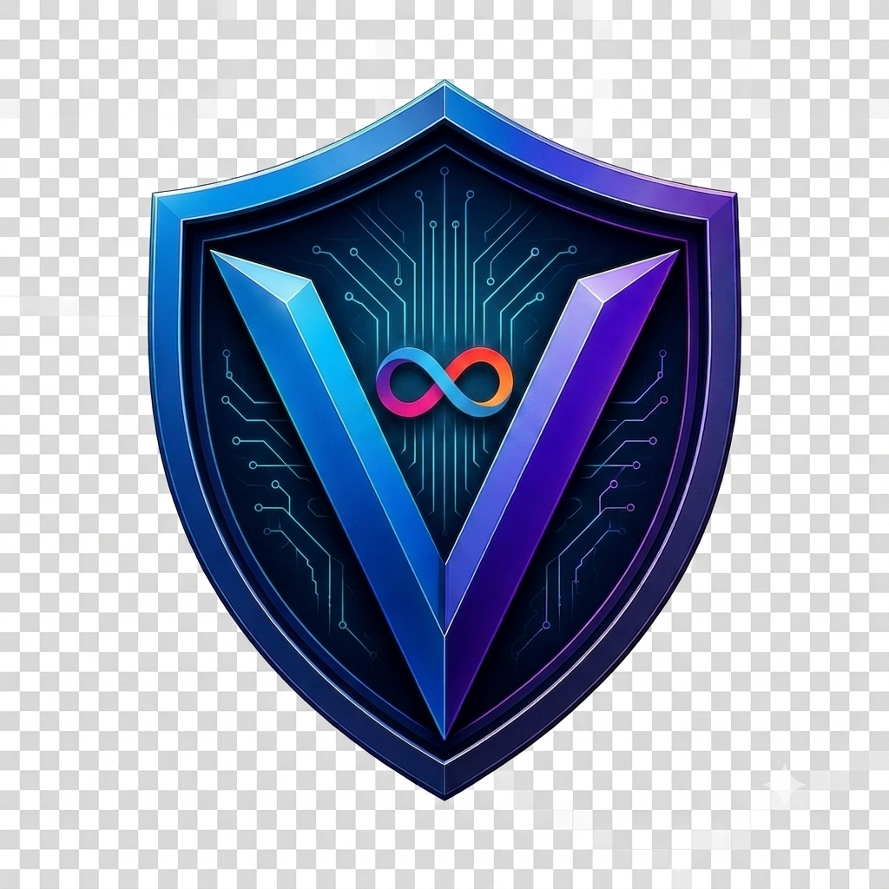
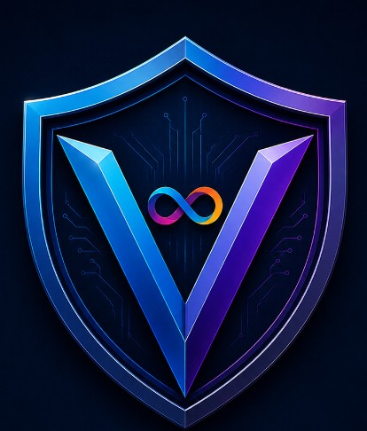

<div align="center">

  <!-- Banner Animado -->
  

  <br><br>

  <!-- Logótipo Completo Principal -->
  

  <br><br>

  <!-- Escudo Correto (valthoris-3d-shield.png) -->
  <p align="center">
    
  </p>

  <h3>INTELLIGENCE • PREVENTION • PROTECTION</h3>
  <h4>CYBERSECURITY • ARTIFICIAL INTELLIGENCE • BLOCKCHAIN • INTERNET COMPUTER</h4>

  <br>

  <!-- Badges em Inglês -->
  <p align="center">
    
    
  </p>

</div>

---

> ⚠️ **Development Notice:** The **Valthoris platform is currently under active development and model training**. Modules and features are being progressively deployed.

---

<p align="center">
  A next-generation Artificial Intelligence platform focused on <strong>Fraud Prevention</strong>, <strong>Cybersecurity</strong>, <strong>Threat Intelligence</strong> and <strong>Digital Identity Protection</strong>.
</p>


---

<p align="center">


</p>

---

> **"The best fraud is the one that never happens."**

### Official Valthoris Manifesto


---

# 🌍 Why Valthoris?

Traditional cybersecurity solutions react **after** an attack.

**Valthoris was designed to act before the attack succeeds.**

Using Artificial Intelligence, Behaviour Analysis, Blockchain and Threat Intelligence, the platform continuously evaluates digital interactions and provides risk assessments in real time.

The objective is simple:

> **Protect people before they become victims.**

---

# ⚡ Core Platform

| Module | Description |
|:-------|:------------|
| 🛡 AutoShield | Real-time fraud prevention engine |
| 🌍 Global Radar | Worldwide fraud intelligence |
| 🧠 AI Core | Transformer-based language model |
| 📡 Threat Intelligence | Global threat feeds |
| 💰 Crypto Intelligence | Wallet & blockchain analysis |
| 👤 Identity Intelligence | Reputation & trust scoring |
| 📍 Safe Location | Secure family location system |
| 🏢 Enterprise | Business security platform |

------

# 🚀 Platform Overview

<div align="center">

| 🛡️ Protection | 🧠 Intelligence | 🌍 Global | ⚡ Real-Time |
|:-------------:|:--------------:|:---------:|:-----------:|
| Fraud Prevention | AI Engine | Threat Intelligence | Instant Analysis |

| 🔐 Privacy | ⛓ Blockchain | 📡 Detection | 🏢 Enterprise |
|:----------:|:------------:|:-----------:|:------------:|
| GDPR by Design | Internet Computer | Behaviour Analysis | Corporate Security |

</div>

---

# 🌐 Ecosystem

```text
                    🌍 USERS

        Android • iPhone • Web • Desktop

                        │
                        ▼

             ┌──────────────────────┐
             │   VALTHORIS CORE AI  │
             └──────────────────────┘

      ┌──────────┬──────────┬──────────┐

      ▼          ▼          ▼

 AutoShield   Threat AI   Reputation

      ▼          ▼          ▼

 Crypto AI   Identity AI  Geo AI

      └──────────┬──────────┘

                 ▼

        Internet Computer (ICP)

                 ▼

        Immutable Security Layer

                 ▼

          Supabase PostgreSQL
```

---

# ⭐ Main Capabilities

| Feature | Description |
|----------|-------------|
| 🛡 **AutoShield** | Detects fraud before users interact with malicious content |
| 🌍 **Global Radar** | Worldwide collaborative fraud intelligence |
| 🧠 **LLM Engine** | Transformer model specialised in fraud detection |
| 📡 **Threat Intelligence** | Aggregates multiple cybersecurity feeds |
| 💰 **Crypto Intelligence** | Blockchain and wallet reputation analysis |
| 👤 **Identity Intelligence** | Digital trust and reputation scoring |
| 📍 **Safe Location** | Secure family and trusted contact tracking |
| 🏢 **Enterprise Security** | Security platform for organisations |

---
# 🎯 Mission

Valthoris was created with a single objective:

> **Prevent digital fraud before victims exist.**

Unlike traditional cybersecurity platforms that analyse incidents after they occur, Valthoris continuously evaluates digital interactions in real time, calculating risk before damage happens.

Every component of the platform follows three immutable principles:

- 🧠 Intelligence
- 🛡 Prevention
- 🔒 Protection

---

# 💡 Why Valthoris Exists

Digital fraud is evolving faster than traditional security systems.

Every day millions of people are exposed to:

- Phishing campaigns
- Social engineering
- Fake investment platforms
- Cryptocurrency scams
- Identity theft
- Business Email Compromise (BEC)
- QR Code attacks
- Voice cloning
- Deepfake scams

Current security solutions usually react **after** the attack.

Valthoris changes this paradigm.

Its mission is simple:

> **Predict. Detect. Protect.**

---

# 🧠 The Valthoris Philosophy

Traditional cybersecurity asks:

> *"How do we respond after the attack?"*

Valthoris asks:

> **"How do we stop the attack before it succeeds?"**

This philosophy guides every decision inside the platform.

Artificial Intelligence is not the objective.

Artificial Intelligence is only the tool.

The real objective is protecting people.

---

# 🛡 The Three Pillars

<div align="center">

| 🧠 Intelligence | 🛡 Prevention | 🔒 Protection |
|:---------------:|:------------:|:-------------:|
| Understand threats | Predict attacks | Protect users |

</div>

---

## 🧠 Intelligence

Artificial Intelligence analyses context.

Not just keywords.

Not just blacklists.

But behaviour.

Patterns.

Intent.

Relationships.

Confidence.

---

## 🛡 Prevention

The safest fraud is the one that never reaches the victim.

Every Valthoris engine is designed to warn the user **before** interacting with malicious content.

---

## 🔒 Protection

When prevention is no longer possible,

the protection layer activates automatically.

Examples:

- Smart Alerts
- Risk Scoring
- Reputation Analysis
- Threat Intelligence
- Blockchain Validation
- Behaviour Analysis

---

# 🌍 Designed for Everyone

Valthoris is built for:

👤 Citizens

🏢 Companies

🏦 Financial Institutions

🎓 Universities

🏥 Healthcare

🏛 Governments

👮 Security Agencies

🌐 International Organizations

---

# ❤️ Human-Centric AI

Artificial Intelligence should never replace human judgement.

Instead,

it should provide enough information for people to make safer decisions.

Technology exists to protect people.

Never to manipulate them.

---

> **"Technology evolves every day. Principles remain forever."**

— Valthoris
---

# 🏛 The Origin of Valthoris

Every great technology begins with a question.

Google wanted to organise the world's information.

OpenAI wanted to democratise Artificial Intelligence.

Cloudflare wanted to make the Internet faster and safer.

**Valthoris was created to answer a different question.**

> **"How can we stop digital fraud before there is a victim?"**

---

## A Name Created From Scratch

**Valthoris** is not a dictionary word.

It does not belong to any language.

It was not generated by Artificial Intelligence.

It was not purchased.

It was not adapted.

It was conceived and created by **Hermínio Coragem** to represent a completely new vision for digital protection.

A name designed to become synonymous with trust, intelligence and cybersecurity.

---

# VAL

The first part of the name represents four fundamental principles.

### ✔ Validation

Trust begins with verification.

Every interaction should be validated.

Every identity should be verified.

Every digital action should be analysed.

---

### ✔ Value

Technology should protect what truly matters.

People.

Businesses.

Institutions.

Data.

Identity.

Trust.

---

### ✔ Vigilance

Security is not passive.

Threats evolve every second.

Valthoris remains vigilant every second.

---

### ✔ Virtue

Artificial Intelligence should never manipulate people.

It should empower them.

Ethics is not an optional feature.

It is part of the architecture.

---

# THORIS

The second part of the name was created to transmit strength.

Not physical strength.

Digital strength.

Resilience.

Authority.

Protection.

Reliability.

Stability.

Its sound immediately evokes confidence without depending on mythology, fiction or existing brands.

---

# More Than A Name

When combined,

**VAL**

+

**THORIS**

becomes more than a brand.

It becomes a philosophy.

A commitment.

A mission.

A platform designed to protect millions of people across the world.

---

<div align="center">

## 🧠 Intelligence

Understanding before reacting.

---

## 🛡 Prevention

Stopping fraud before damage exists.

---

## 🔒 Protection

Technology at the service of people.

</div>

---

> **"Trust should never be assumed. Trust must always be validated."**

### — Valthoris Philosophy

---
---

# 🌍 Vision

Valthoris was never designed to become just another cybersecurity application.

It was conceived as an intelligent ecosystem capable of protecting people, businesses and institutions through Artificial Intelligence, Behaviour Analysis, Blockchain and Threat Intelligence.

The long-term objective is ambitious.

To become one of the world's leading AI platforms dedicated exclusively to fraud prevention.

Not by replacing existing security solutions.

But by complementing them with predictive intelligence.

---

# 🎯 Mission

Our mission is simple.

Build an Artificial Intelligence capable of reducing digital fraud before financial, operational or reputational damage occurs.

Every component of Valthoris follows the same objective:

- Detect threats earlier.
- Explain risks clearly.
- Protect users ethically.
- Learn continuously.
- Improve every single day.

---

# 🚀 Vision Statement

We believe the future of cybersecurity will not depend only on stronger passwords or larger firewalls.

It will depend on intelligent systems capable of understanding context.

Understanding behaviour.

Understanding intention.

Understanding trust.

That future is what Valthoris is being built for.

---

# ❤️ Core Values

## 🧠 Intelligence

Knowledge always comes before action.

Artificial Intelligence exists to assist human judgement, never replace it.

---

## 🛡 Prevention

The safest cyberattack is the one that never reaches the victim.

Everything inside Valthoris is designed around prediction instead of reaction.

---

## 🔒 Protection

Technology only has value when it protects people.

Every algorithm.

Every model.

Every decision.

Must contribute to a safer digital world.

---

## ⚖ Ethics

Artificial Intelligence must always remain accountable.

Transparent.

Auditable.

Explainable.

Responsible.

Users should understand why a risk exists.

Not simply receive a warning.

---

## 🌍 Privacy

Privacy is not a feature.

It is a fundamental right.

Valthoris follows:

- Privacy by Design
- Privacy by Default
- Security by Design
- Zero Trust Architecture

from the very beginning.

---

## 🚀 Innovation

Cybercrime evolves every day.

So must we.

Research.

Learning.

Improvement.

Continuous innovation is part of the Valthoris DNA.

---

## 🤝 Collaboration

No organisation can fight digital fraud alone.

Real protection requires collaboration between:

- Citizens
- Businesses
- Universities
- Researchers
- CERTs
- CSIRTs
- Financial Institutions
- Governments

Valthoris is designed to become the bridge between all of them.

---

> **"Technology should never replace trust.
Technology should strengthen it."**

— Valthoris Principles

---
---

# 🛡 Platform Philosophy

## Security Should Never Be Reactive.

It Should Be Predictive.

For decades, cybersecurity has largely followed the same pattern.

A cyberattack happens.

The victim discovers the damage.

Only then does the investigation begin.

Logs are analysed.

Evidence is collected.

Recovery starts.

By that point, the damage has already been done.

Valthoris challenges that paradigm.

Its philosophy is fundamentally different.

The objective is not simply to detect fraud.

The objective is to prevent fraud before a victim exists.

That single principle influences every architectural decision made within the platform.

---

# The Five Foundations of Valthoris

Every component of the ecosystem has been designed around five fundamental pillars.

---

# 🧠 Intelligence

Artificial Intelligence is the foundation of Valthoris.

Not as a marketing feature.

Not as a chatbot.

But as a distributed network of specialised engines capable of analysing context, behaviour, reputation and threat intelligence simultaneously.

Every decision is based on evidence.

Every model has a purpose.

Every prediction contributes to reducing uncertainty.

---

# 🛡 Prevention

Traditional cybersecurity reacts.

Valthoris anticipates.

Whenever possible, users should receive a warning before interacting with potentially dangerous content.

Examples include:

- Suspicious phone calls
- Fraudulent SMS
- Phishing emails
- Fake websites
- QR codes
- Cryptocurrency scams
- Fake investment platforms
- Social engineering attempts

The safest incident is the one that never happens.

---

# 🔒 Protection

When prevention is no longer sufficient, protection takes over.

Multiple security layers work together to minimise exposure.

Examples include:

- Intelligent warnings
- Reputation scoring
- Behaviour analysis
- Risk validation
- Multi-source verification
- Dynamic threat correlation

Security is never provided by a single mechanism.

Protection comes from combining many independent layers.

---

# 🌍 Trust

Trust should never be assumed.

Every entity receives a continuously updated Trust Score.

Examples include:

- Phone numbers
- Email addresses
- Domains
- Websites
- Companies
- Wallet addresses
- IBANs
- IP addresses
- Applications

Trust is calculated.

Never presumed.

---

# 🚀 Evolution

Cybercrime evolves every day.

Therefore Valthoris must evolve every day.

Every confirmed report.

Every detected campaign.

Every analysed behaviour.

Every validated threat.

Strengthens the intelligence of the platform.

Learning never stops.

---

# Security by Design

Security is not added after development.

It exists before development begins.

Authentication.

Encryption.

Authorisation.

Logging.

Validation.

Auditing.

Monitoring.

All security mechanisms are considered during architectural design rather than being integrated afterwards.

---

# Privacy by Design

Privacy follows exactly the same philosophy.

The platform only processes the information that is strictly necessary.

Where possible:

- Minimal collection
- Minimal retention
- Minimal exposure
- Maximum transparency
- User control by default

Privacy is treated as an engineering principle rather than a legal obligation.

---

# Zero Trust Architecture

Valthoris follows the Zero Trust model.

**Never Trust. Always Verify.**

No device.

No user.

No application.

No API.

No service.

Is automatically trusted simply because it has already connected before.

Every request is verified.

Every interaction is validated.

Every decision is contextual.

---

# Defence in Depth

Security exists across multiple independent layers.

```text
User

↓

Authentication

↓

Authorisation

↓

API Gateway

↓

Artificial Intelligence

↓

Threat Intelligence

↓

Risk Engine

↓

Blockchain Validation

↓

Immutable Audit Logs

↓

Monitoring
```

Even if one layer fails,

the remaining layers continue protecting the platform.

---

# Human-Centred Artificial Intelligence

Artificial Intelligence should never replace human judgement.

Its role is different.

To provide better information.

Earlier.

More accurately.

More transparently.

Every recommendation generated by Valthoris should help people make better decisions rather than making decisions for them.

---

> **"True innovation is not reacting faster.
It is preventing the attack from happening."**

### — Valthoris Platform Philosophy

---
---

# 🏗 Global Architecture

## One Platform.

## One Ecosystem.

## One Distributed Intelligence.

Valthoris has never been designed as a standalone application.

From its very first blueprint, it was envisioned as a distributed cybersecurity ecosystem capable of protecting individuals, organisations and public institutions on a global scale.

Instead of concentrating every service inside a single server, the platform distributes intelligence across specialised components.

Each module has a single responsibility.

Each component can evolve independently.

Each service contributes to a collective intelligence greater than the sum of its parts.

This architecture provides:

- Scalability
- High Availability
- Fault Tolerance
- Security by Design
- Modular Evolution
- Global Expansion

---

# High-Level Architecture

```text
                    🌍 USERS

        Android • iPhone • Web • Desktop

                        │
                        ▼

        ┌──────────────────────────────────┐
        │       React + TypeScript         │
        │         Capacitor / PWA          │
        └──────────────────────────────────┘

                        │

                        ▼

        ┌──────────────────────────────────┐
        │      VALTHORIS API GATEWAY       │
        └──────────────────────────────────┘

          │             │             │

          ▼             ▼             ▼

   ┌────────────┐ ┌────────────┐ ┌────────────┐

   │ Supabase   │ │ AI Engines │ │ ICP Chain │

   └────────────┘ └────────────┘ └────────────┘

          │             │             │

          ▼             ▼             ▼

   PostgreSQL      Threat AI      Canisters

   Auth            Prediction     Immutable Logs

   Storage         Reputation     Distributed Storage

   Realtime        Behaviour      Smart Contracts
```

---

# Layer One

## User Experience

The first layer represents every interaction with the platform.

The objective is to provide exactly the same experience regardless of the device being used.

Supported platforms include:

- Android
- iOS
- Windows
- macOS
- Linux
- Progressive Web App

Only presentation logic exists within the client.

Sensitive processing never occurs inside the user interface.

---

# Layer Two

## API Gateway

Every request passes through a central gateway.

This gateway performs:

- Authentication
- Authorisation
- Validation
- Rate Limiting
- Monitoring
- Request Routing
- Logging
- Security Policies

No internal service communicates directly without passing through this gateway.

This simplifies security auditing and greatly reduces the attack surface.

---

# Layer Three

## Operational Data Layer

Operational information is managed through Supabase.

Responsibilities include:

- User Accounts
- Authentication
- Sessions
- Permissions
- Reports
- Notifications
- Analytics
- Configuration
- Community Data
- Dashboards

The relational database stores operational information while maintaining strong consistency and high performance.

---

# Layer Four

## Artificial Intelligence Layer

This layer represents the cognitive core of the platform.

Instead of relying on a single monolithic model, Valthoris distributes intelligence across specialised engines.

Each engine performs a different task.

Examples include:

- Fraud Detection
- Behaviour Analysis
- Threat Prediction
- Reputation Analysis
- Identity Intelligence
- Crypto Intelligence
- Conversation Intelligence

The AI Gateway coordinates communication between every model.

---

# Layer Five

## Internet Computer Protocol

The Internet Computer Protocol provides decentralisation where decentralisation genuinely creates value.

Rather than replacing traditional databases, ICP complements them.

Typical responsibilities include:

- Immutable audit logs
- Digital evidence
- Hash validation
- Certificates
- Distributed storage
- Cryptographic verification
- Long-term integrity

Sensitive evidence can therefore be verified independently from any single organisation.

---

# Distributed Canisters

The architecture anticipates multiple specialised canisters.

Examples include:

- Authentication
- Users
- Reports
- Threat Intelligence
- Safe Location
- Community
- Crypto Intelligence
- Notifications
- Audit
- Enterprise
- Statistics
- AI Gateway

Each canister remains independent.

Each can be upgraded individually.

Each scales independently.

---

# Communication Model

Every component communicates through clearly defined interfaces.

```text
Frontend

↓

API Gateway

↓

Authentication

↓

Service Layer

↓

Artificial Intelligence

↓

Database

↓

Blockchain Validation

↓

Response
```

The result is a predictable, secure and highly maintainable architecture.

---

# High Availability

The platform has been designed with resilience as a primary objective.

Future deployments are expected to support:

- Horizontal Scaling
- Geographic Distribution
- Automatic Failover
- Redundant Services
- Continuous Deployment
- Rolling Updates
- Disaster Recovery

No single component should become a single point of failure.

---

# Designed For The Future

The architecture is intended to support:

- Millions of users
- Millions of fraud reports
- Thousands of requests per second
- Real-time Artificial Intelligence
- International expansion
- Government integration
- Banking integrations
- Telecommunications operators
- CERTs
- Law Enforcement cooperation (where legally applicable)

Every architectural decision has been taken with long-term evolution in mind.

---

> **"Great architecture is not the one that solves today's problems.
It is the one that remains prepared for tomorrow's challenges."**

### — Valthoris Architecture
---
---

# 🧠 Artificial Intelligence Ecosystem

## One Intelligence.

## Multiple Brains.

## One Mission.

Artificial Intelligence is the beating heart of Valthoris.

But unlike traditional AI platforms, Valthoris is not built around a single model.

Instead, it relies on a distributed ecosystem of specialised AI engines.

Each engine has one responsibility.

Each engine becomes exceptionally good at solving a specific problem.

Together they form a collaborative intelligence capable of understanding, analysing and predicting digital threats before they become real incidents.

---

# Cognitive Architecture

```text
                    User Request

                         │

                         ▼

                 AI Gateway Core

                         │

 ┌──────────┬──────────┬──────────┬──────────┬──────────┐

 ▼          ▼          ▼          ▼          ▼

Fraud    Behaviour  Reputation Identity Prediction

Engine      AI          AI          AI          AI

 └──────────┴──────────┴──────────┴──────────┴──────────┘

                         │

                         ▼

              Risk Decision Engine

                         │

                         ▼

                Final Intelligent Result
```

---

# AI Gateway

The AI Gateway is the coordinator of the entire cognitive ecosystem.

Rather than performing analysis itself, it distributes tasks to specialised engines and combines their conclusions into a unified response.

Responsibilities include:

- Model orchestration
- Context management
- Confidence calculation
- Decision aggregation
- Explainability
- Request optimisation
- Security validation

Every AI request passes through this gateway.

---

# Fraud Detection Engine

The first specialised intelligence engine.

Designed specifically to detect fraud indicators.

It analyses:

- SMS
- Emails
- URLs
- QR Codes
- Websites
- PDF Documents
- Phone Calls
- Messages
- Wallet Addresses
- IBANs
- Domains

Its objective is simple:

Identify malicious intent before user interaction.

---

# Behaviour Intelligence

Fraud rarely depends on technology alone.

It depends on human manipulation.

The Behaviour Engine analyses communication patterns rather than isolated words.

Examples include:

- Artificial urgency
- Emotional pressure
- Fear induction
- Fake authority
- Financial coercion
- Romance scams
- Business Email Compromise
- Social Engineering

Instead of asking

*"What was written?"*

it asks

*"Why was it written this way?"*

---

# Reputation Intelligence

Every digital entity accumulates a continuously evolving reputation.

Entities include:

- Telephone Numbers
- Email Addresses
- Domains
- Companies
- Cryptocurrency Wallets
- Applications
- Websites
- IBANs
- IP Addresses

Reputation is never static.

It evolves dynamically as new evidence becomes available.

---

# Identity Intelligence

Identity Intelligence evaluates trust without attempting to identify private individuals.

It focuses on publicly available technical indicators such as:

- Domain history
- Digital consistency
- Public registrations
- Certificate validity
- Infrastructure quality
- Historical behaviour

Its purpose is not surveillance.

Its purpose is validation.

---

# Prediction Engine

Traditional security reacts.

Valthoris predicts.

Using historical patterns and behavioural models, the Prediction Engine estimates future risk.

Examples include:

- Emerging phishing campaigns
- Newly weaponised domains
- Coordinated scam operations
- Fraud propagation
- Cryptocurrency attacks
- Social engineering trends

Prediction transforms Artificial Intelligence into proactive defence.

---

# Conversation Intelligence

Communication carries context.

Conversation Intelligence analyses interactions across multiple platforms.

Examples include:

- WhatsApp
- Signal
- Telegram
- Messenger
- SMS
- Email
- Internal Chats

Whenever technically possible, analysis is performed locally to maximise privacy.

---

# Audio Intelligence

Fraud increasingly happens through voice.

The Audio Engine detects:

- Voice cloning
- Deepfake speech
- Telephone scams
- Fake technical support
- Emotional manipulation
- Identity spoofing

Its objective is assistance during communication rather than recording conversations.

---

# Visual Intelligence

Images frequently contain hidden threats.

The Visual Engine analyses:

- Screenshots
- Invoices
- Documents
- Identity Cards
- QR Codes
- Fake Interfaces
- Banking Screens
- Cryptocurrency Transactions

Computer Vision complements language understanding.

---

# Malware Intelligence

Files are analysed before execution.

Supported content includes:

- APK files
- Executables
- Scripts
- PDFs
- Office Documents
- Archives
- URLs
- Hashes

Known malware signatures are combined with behavioural analysis.

---

# Crypto Intelligence

Blockchain ecosystems introduce entirely new fraud vectors.

The Crypto Engine evaluates:

- Wallet Addresses
- Smart Contracts
- Tokens
- NFTs
- Transactions
- Rug Pulls
- Honeypots
- Mixers
- Wash Trading
- Scam Campaigns

Each wallet receives its own dynamic reputation score.

---

# Learning Engine

Artificial Intelligence must evolve continuously.

The Learning Engine allows the platform to improve through:

- Confirmed reports
- Expert validation
- Community contributions
- Emerging attack patterns
- Threat Intelligence feeds

Learning never occurs blindly.

Human validation remains essential.

---

# Human-in-the-Loop

Artificial Intelligence should assist human judgement.

Never replace it.

Whenever confidence becomes insufficient:

Requests may be escalated to:

- Fraud Analysts
- Security Researchers
- Moderators
- Technical Specialists

Human expertise remains the final authority.

---

# Explainable Artificial Intelligence

Every decision should be understandable.

Instead of returning:

> High Risk

Valthoris explains:

- Indicators detected
- Reputation changes
- Behavioural patterns
- Threat sources
- Confidence level
- Historical evidence

Transparency builds trust.

---

# Cognitive Principles

Every AI engine follows the same philosophy.

Think before reacting.

Validate before trusting.

Explain before deciding.

Learn before evolving.

Protect before damage exists.

---

> **"Artificial Intelligence becomes truly valuable when it helps people understand risk rather than simply calculating it."**

### — Valthoris Cognitive Architecture

---
---

# 🌐 Threat Intelligence

## Global Intelligence.

## Continuous Awareness.

## Real-Time Protection.

Artificial Intelligence alone is not enough.

The most advanced AI model cannot identify a threat it has never seen before.

That is why Valthoris combines Artificial Intelligence with continuously updated Threat Intelligence.

Every analysis is enriched with information collected from trusted cybersecurity sources around the world.

The objective is simple.

Always know more than the attacker.

---

# What Is Threat Intelligence?

Threat Intelligence is the process of collecting, validating and correlating information about cyber threats.

Instead of relying exclusively on historical data,

Valthoris continuously incorporates fresh intelligence from multiple independent sources.

This allows the platform to identify:

- Active phishing campaigns
- Emerging malware
- Compromised domains
- Fraudulent infrastructure
- Cryptocurrency scams
- Fake identities
- Botnet activity
- Command & Control servers
- Malicious IP addresses

before traditional blacklists are updated.

---

# Multi-Source Intelligence

No single provider possesses complete visibility.

For that reason, Valthoris aggregates intelligence from multiple trusted sources.

Examples include:

- AbuseIPDB
- VirusTotal
- PhishTank
- OpenPhish
- URLHaus
- Spamhaus
- AlienVault OTX
- CISA Advisories
- ENISA
- CERT Portugal
- MITRE ATT&CK
- CVE Database

Additional proprietary intelligence generated by the platform itself further strengthens detection capabilities.

---

# Threat Correlation

Threat Intelligence is not simply stored.

It is correlated.

Every indicator is evaluated against hundreds of contextual signals.

Examples include:

- Domain reputation
- SSL certificates
- WHOIS history
- DNS records
- Hosting infrastructure
- ASN ownership
- Geographic distribution
- Previous reports
- AI behavioural analysis

A single suspicious indicator rarely defines a threat.

Correlation creates confidence.

---

# Threat Categories

The platform classifies threats across multiple categories.

### 🎣 Phishing

Credential harvesting.

Fake login pages.

Bank impersonation.

Corporate impersonation.

---

### 💰 Financial Fraud

Investment scams.

Fake brokers.

Advance-fee fraud.

Business Email Compromise.

---

### 🦠 Malware

Ransomware.

Spyware.

Remote Access Trojans.

Information stealers.

Malicious APKs.

---

### 🌍 Infrastructure

Compromised domains.

Malicious IP addresses.

Suspicious hosting providers.

Botnet infrastructure.

---

### 💳 Cryptocurrency

Fake exchanges.

Wallet scams.

Smart contract exploits.

Rug Pulls.

Ponzi schemes.

---

# Dynamic Threat Scoring

Every threat receives its own continuously updated score.

The score considers:

- Freshness
- Confidence
- Source credibility
- Historical behaviour
- Community validation
- AI analysis
- Reputation changes

Threat intelligence is therefore never static.

It evolves continuously.

---

# Community Intelligence

Users also contribute.

Every validated report strengthens the platform.

Community reports include:

- Scam phone numbers
- Fake websites
- Fraudulent emails
- Cryptocurrency scams
- Fake companies
- Suspicious wallets

Each report undergoes automatic validation before affecting the global reputation database.

Quality is always prioritised over quantity.

---

# Real-Time Updates

Threat Intelligence never sleeps.

Feeds are continuously synchronised.

Indicators are updated automatically.

Artificial Intelligence immediately benefits from every newly discovered threat.

This creates a constantly evolving defence network.

---

# Threat Decision Engine

The Threat Intelligence Engine works alongside every AI model.

```text
Threat Intelligence

          │

          ▼

Reputation Analysis

          │

          ▼

Behaviour Analysis

          │

          ▼

Artificial Intelligence

          │

          ▼

Global Risk Score
```

No decision depends on a single source.

Confidence comes from multiple independent layers working together.

---

# Global Threat Map

Future versions of Valthoris will include a live global threat map.

It will visualise:

- Active phishing campaigns
- Scam hotspots
- Malware outbreaks
- Fraud trends
- Community reports
- Geographic distribution

Providing situational awareness in real time.

---

# Continuous Evolution

Threat Intelligence changes every minute.

Therefore Valthoris continuously:

- Collects
- Validates
- Correlates
- Learns
- Predicts

Every confirmed threat improves the intelligence available to every user.

---

> **"Information becomes intelligence only when it helps prevent the next attack."**

### — Valthoris Threat Intelligence

---
---

# 🛡 AutoShield

## Protection That Never Sleeps.

Traditional cybersecurity solutions wait for users to make mistakes.

Valthoris does not.

AutoShield is the platform's real-time protection layer, designed to analyse digital interactions before they become incidents.

Rather than functioning as a passive antivirus or simple blacklist, AutoShield continuously evaluates risk using Artificial Intelligence, Threat Intelligence and behavioural analysis.

Its objective is straightforward.

Protect users before they become victims.

---

# How AutoShield Works

Every interaction follows the same intelligent pipeline.

```text
Incoming Event

        │

        ▼

Threat Intelligence

        │

        ▼

Artificial Intelligence

        │

        ▼

Behaviour Analysis

        │

        ▼

Reputation Engine

        │

        ▼

Risk Decision Engine

        │

        ▼

Protection Recommendation
```

Every stage contributes to the final decision.

No single indicator is ever considered sufficient.

---

# Continuous Monitoring

AutoShield continuously evaluates:

- SMS messages
- Phone calls
- Emails
- URLs
- QR Codes
- Files
- Cryptocurrency wallets
- Bank information
- Applications
- Browser activity
- Downloads

Monitoring happens in real time whenever technically possible.

---

# Intelligent Warnings

Instead of generating unnecessary alerts,

AutoShield prioritises quality over quantity.

Warnings include:

🟢 Safe

🟡 Suspicious

🟠 High Risk

🔴 Critical Threat

Every warning is accompanied by an explanation.

Users should always understand why something has been classified as dangerous.

---

# Multi-Layer Protection

AutoShield combines several independent protection mechanisms.

### Behaviour Analysis

Detects manipulation techniques.

---

### Reputation Verification

Checks historical trust.

---

### Threat Intelligence

Searches active campaigns.

---

### Artificial Intelligence

Evaluates linguistic and contextual indicators.

---

### Blockchain Validation

Verifies immutable evidence where applicable.

---

# Adaptive Protection

Cybercriminals constantly change their tactics.

AutoShield adapts accordingly.

Its detection models evolve continuously through:

- New intelligence feeds
- Community reports
- Human validation
- Machine learning improvements
- Behavioural feedback

Protection therefore becomes progressively stronger over time.

---

# Privacy First

AutoShield has been designed according to Privacy by Design principles.

Whenever possible:

- Analysis occurs locally.
- Only essential information is processed.
- Personal data is minimised.
- Users remain in control.

Protection never requires unnecessary surveillance.

---

# Future Capabilities

Future versions of AutoShield will include:

- Automatic scam call interception
- Live browser protection
- Real-time phishing blocking
- QR Code verification
- Cryptocurrency transaction validation
- Smart notification prioritisation
- Offline AI analysis
- Enterprise security policies

---

> **"Protection should begin before the first click."**

### — AutoShield Philosophy

---

# 🌍 Global Fraud Radar

## Collective Intelligence Against Global Fraud.

Fraud evolves through collaboration.

Protection should do the same.

The Global Fraud Radar transforms isolated reports into collective intelligence.

Every validated report contributes to protecting every other user.

---

# Community-Driven Protection

Every report submitted to Valthoris becomes part of a continuously evolving intelligence network.

Examples include:

- Scam phone numbers
- Fraudulent domains
- Fake companies
- Phishing campaigns
- Cryptocurrency scams
- Social engineering attacks

Reports are never accepted automatically.

Every submission undergoes technical validation before becoming part of the intelligence database.

---

# Dynamic Risk Mapping

The Global Fraud Radar continuously maps threats across regions.

Future visualisations will display:

- Active phishing campaigns
- Fraud concentration
- Emerging scam trends
- Cryptocurrency attacks
- Malicious infrastructure
- Community alerts

Users gain situational awareness before becoming targets.

---

# Reputation Through Evidence

Every validated report influences reputation scores.

Confidence increases through:

- Multiple independent reports
- Threat Intelligence
- Artificial Intelligence
- Historical consistency
- Human validation

False reports are automatically filtered whenever possible.

---

# Collaborative Security

Security improves when knowledge is shared.

The Global Fraud Radar enables collaboration between:

- Citizens
- Businesses
- Security researchers
- CERTs
- Universities
- Public institutions

Each participant strengthens the ecosystem.

---

# Designed For Scale

The architecture has been designed to support:

- Millions of reports
- Global contributors
- Real-time synchronisation
- Distributed validation
- International expansion

Community intelligence becomes stronger as adoption increases.

---

> **"One validated report can protect millions."**

### — Global Fraud Radar

---
---

# 🔎 Universal Intelligence Scanner

## One Scan.

## Complete Visibility.

The Universal Scanner is designed to analyse virtually every digital element a user may encounter.

Rather than requiring multiple specialised tools, Valthoris provides a single intelligent scanner capable of evaluating different types of content using the same security ecosystem.

Every scan combines Artificial Intelligence, Threat Intelligence, Reputation Analysis and Behavioural Intelligence.

---

# Supported Objects

The scanner is designed to analyse:

- URLs
- Websites
- Domains
- QR Codes
- Email Addresses
- Phone Numbers
- SMS
- Images
- PDF Documents
- Office Files
- APK Applications
- Cryptocurrency Wallets
- Smart Contracts
- IBANs
- Bank Accounts
- IP Addresses

Future versions will continuously expand supported formats.

---

# Unified Analysis Pipeline

Every object follows the same verification process.

```text
Input

      │

      ▼

Format Detection

      │

      ▼

Threat Intelligence

      │

      ▼

Artificial Intelligence

      │

      ▼

Behaviour Analysis

      │

      ▼

Reputation Engine

      │

      ▼

Risk Score

      │

      ▼

Recommendation
```

This unified architecture guarantees consistent decision making across every module.

---

# Intelligent Reports

Instead of displaying raw technical information,

the scanner produces structured reports including:

- Overall Risk Score
- Threat Classification
- Reputation
- Technical Indicators
- AI Explanation
- Confidence Level
- Recommended Action

The objective is clarity.

Users should immediately understand the level of risk.

---

# QR Code Analysis

QR Codes have become one of the fastest growing fraud vectors.

The scanner validates:

- Destination URL
- Hidden redirects
- Reputation
- Domain age
- SSL configuration
- Previous reports
- Active phishing campaigns

Before the QR Code is opened.

---

# Email Intelligence

Emails are analysed using multiple layers.

Detection includes:

- Domain spoofing
- Display-name impersonation
- Urgency indicators
- Malicious attachments
- Embedded URLs
- Language manipulation
- AI-generated fraud patterns

---

# Document Inspection

Documents can hide malicious content.

Supported formats include:

- PDF
- DOCX
- XLSX
- PPTX

The scanner evaluates:

- Embedded links
- Macros
- Scripts
- Metadata
- Suspicious behaviour
- Hidden payloads

---

# Cryptocurrency Verification

The scanner validates:

- Wallet reputation
- Token legitimacy
- Smart contract risks
- Rug Pull indicators
- Honeypot behaviour
- Known scam databases

Helping users make safer blockchain transactions.

---

# Explainable Results

Every result answers three questions.

**What was analysed?**

**What was detected?**

**Why was this classified as risky?**

Transparency is always prioritised over black-box decisions.

---

# Future Vision

The Universal Scanner is expected to become the primary entry point into the Valthoris ecosystem.

One scan.

One report.

One intelligent decision.

---

> **"Knowledge is the first layer of protection."**

### — Universal Scanner

---

# 💰 Crypto Intelligence

## Securing The Decentralised Economy.

Blockchain technology has transformed finance.

Unfortunately,

it has also transformed fraud.

Every day thousands of malicious wallets, fake tokens, phishing websites and fraudulent smart contracts appear across multiple blockchains.

Crypto Intelligence was created to reduce that risk.

---

# Supported Networks

Future support includes:

- Internet Computer
- Bitcoin
- Ethereum
- Solana
- Polygon
- BNB Chain
- Avalanche
- Arbitrum
- Optimism
- Base

The architecture remains blockchain agnostic.

---

# Wallet Analysis

Every wallet receives a continuously updated reputation profile.

Evaluation considers:

- Transaction history
- Previous reports
- Mixer interaction
- Scam databases
- AI behavioural analysis
- Network relationships
- Contract interaction

The result becomes a dynamic Trust Score.

---

# Smart Contract Analysis

Contracts are inspected before interaction.

The engine searches for:

- Honeypots
- Hidden permissions
- Unlimited approvals
- Rug Pull indicators
- Ownership risks
- Suspicious functions
- External dependencies

Helping users avoid malicious decentralised applications.

---

# Token Intelligence

Every token is evaluated using multiple indicators.

Examples include:

- Liquidity
- Holder concentration
- Mint permissions
- Trading restrictions
- Ownership decentralisation
- Historical behaviour
- Community reputation

The objective is identifying abnormal risk before investment decisions are made.

---

# Blockchain Threat Intelligence

Crypto Intelligence combines:

- On-chain analysis
- Artificial Intelligence
- Public threat databases
- Community reports
- Behavioural models

Producing significantly stronger results than isolated blockchain explorers.

---

# Risk Categories

Crypto assets may receive classifications such as:

🟢 Trusted

🟡 Low Risk

🟠 Suspicious

🔴 High Risk

⚫ Confirmed Scam

Each classification includes technical justification.

---

# Future Development

Future versions will include:

- Live transaction simulation
- MEV risk detection
- DeFi protocol analysis
- NFT verification
- Wallet monitoring
- Portfolio Risk Dashboard
- AI investment scam detection

---

> **"Blockchain removes intermediaries.
It should never remove security."**

### — Crypto Intelligence

---
---

# 🏢 Enterprise Intelligence

## Cybersecurity Beyond The Individual.

Modern cyber threats rarely target only individuals.

Organised cybercriminals increasingly focus on businesses, hospitals, municipalities, financial institutions and critical infrastructure.

Enterprise Intelligence extends the Valthoris ecosystem beyond personal protection, providing organisations with an intelligent platform capable of monitoring, analysing and mitigating digital risk across their entire infrastructure.

---

# Designed For Organisations

Enterprise Intelligence has been designed for:

- Small Businesses
- Medium Enterprises
- Large Corporations
- Financial Institutions
- Government Agencies
- Healthcare Organisations
- Universities
- Telecommunications Providers
- Critical Infrastructure Operators

Every deployment remains modular and scalable.

---

# Central Security Dashboard

Administrators gain access to a unified operational dashboard providing complete visibility over organisational security.

Features include:

- Active Threats
- Incident Timeline
- User Alerts
- Reputation Monitoring
- AI Decisions
- Threat Intelligence
- Device Status
- API Health
- Infrastructure Monitoring

The dashboard becomes the central command centre of the organisation.

---

# Role-Based Access Control

Enterprise environments require precise permission management.

Supported roles include:

- Administrator
- Security Analyst
- SOC Operator
- Auditor
- Investigator
- Compliance Officer
- Read-Only Observer

Every action is controlled through granular permissions.

---

# Security Policies

Organisations may define their own protection policies.

Examples include:

- Block High Risk URLs
- Warn Before Crypto Transfers
- Require Multi-Factor Confirmation
- Restrict External Attachments
- Validate QR Codes
- Prevent Suspicious Downloads

Policies are centrally managed and automatically enforced.

---

# Incident Management

Every detected event generates a structured incident.

Each incident includes:

- Timestamp
- Severity
- AI Explanation
- Technical Evidence
- Threat Intelligence
- Recommended Actions
- Investigation History

Incidents remain fully traceable.

---

# Security Analytics

Enterprise Intelligence continuously generates operational metrics.

Examples include:

- Threat Volume
- Detection Accuracy
- Attack Categories
- User Exposure
- Response Times
- False Positive Rates
- Security Trends

Historical analytics support strategic decision making.

---

# Compliance Support

The platform has been designed to assist organisations in meeting regulatory obligations.

Future compliance support includes:

- GDPR
- NIS2
- DORA
- ISO 27001
- ISO 22301
- AI Act
- eIDAS

Compliance reporting becomes significantly simpler through automated evidence collection.

---

# Audit Logs

Every administrative operation is recorded.

Examples include:

- Login
- Configuration Changes
- User Management
- Security Policy Updates
- Investigation Actions
- AI Decisions
- Report Validation

Logs may later be anchored on the Internet Computer Protocol for immutable verification.

---

# Enterprise API

Large organisations frequently require integration with existing infrastructure.

Future APIs will support integration with:

- SIEM Platforms
- SOAR Solutions
- Identity Providers
- Ticketing Systems
- Banking Systems
- Government Services
- Internal Security Platforms

The objective is interoperability rather than replacement.

---

# Future Vision

Enterprise Intelligence is expected to evolve into a complete cybersecurity platform capable of protecting organisations through intelligent automation, explainable Artificial Intelligence and decentralised trust.

---

> **"Cybersecurity is no longer only about protecting systems.
It is about protecting trust."**

### — Enterprise Intelligence

---

# 📊 Security Dashboard

## One View.

## Complete Awareness.

The Security Dashboard transforms complex cybersecurity information into clear operational intelligence.

Rather than displaying isolated alerts, the dashboard correlates every source of information into a single operational view.

---

# Live Overview

The dashboard provides real-time visibility into:

- Active Threats
- Recent Alerts
- Community Reports
- AI Activity
- Threat Intelligence
- Infrastructure Health
- Blockchain Status
- API Performance

Everything updates continuously.

---

# Risk Indicators

Every monitored entity receives its own dynamic score.

Examples include:

- Users
- Devices
- Domains
- Wallets
- Companies
- Networks
- Applications

Scores evolve automatically as new evidence appears.

---

# Global Metrics

Typical metrics include:

- Protected Users
- Analysed URLs
- Blocked Threats
- AI Predictions
- Community Reports
- Reputation Changes
- Threat Intelligence Updates

Metrics focus on operational value rather than vanity numbers.

---

# Visual Analytics

The dashboard supports multiple visualisations.

Examples include:

- Threat Timeline
- Geographic Distribution
- Category Breakdown
- Risk Evolution
- Community Activity
- Infrastructure Status

Every chart is designed to simplify decision making.

---

# Executive Reporting

Future versions will generate automated reports suitable for:

- Executives
- Compliance Officers
- Security Teams
- Auditors
- Government Agencies

Reports remain clear, objective and technically verifiable.

---

# Designed For Humans

Cybersecurity information should never overwhelm users.

The dashboard prioritises:

- Simplicity
- Clarity
- Transparency
- Actionable Information

Complexity remains behind the scenes.

---

> **"Information becomes valuable only when it supports better decisions."**

### — Valthoris Dashboard

---
---

# 🔐 Security, Privacy & Compliance

## Trust Must Be Built.

## Not Assumed.

Cybersecurity is not a feature.

It is the foundation upon which Valthoris is built.

Every architectural decision, every AI model and every future module follows internationally recognised security principles designed to protect users by default.

---

# Security by Design

Security exists before functionality.

Every component is designed with protection as its first requirement.

Examples include:

- Authentication
- Authorization
- Encryption
- Validation
- Audit Logging
- Threat Monitoring
- API Protection
- Secure Development Lifecycle

Security is never added afterwards.

It is part of the architecture itself.

---

# Privacy by Design

Privacy is treated as a fundamental right.

Valthoris follows European privacy principles from the very beginning.

Whenever technically possible:

- Minimum data collection
- Minimum retention
- Local processing
- User control
- Transparent consent
- Secure storage
- End-to-end encryption

Personal information always belongs to the user.

Never to the platform.

---

# Zero Trust Architecture

Valthoris adopts a Zero Trust security model.

Its philosophy is simple.

> Never Trust.

> Always Verify.

Every request is validated.

Every session is verified.

Every API call is authenticated.

Every permission is checked.

Nothing is automatically trusted.

---

# Defence In Depth

Security is distributed across multiple independent layers.

```text
User

↓

Authentication

↓

Authorization

↓

API Gateway

↓

Rate Limiting

↓

Artificial Intelligence

↓

Threat Intelligence

↓

Database

↓

ICP Blockchain

↓

Immutable Audit Logs
```

If one layer fails,

the remaining layers continue protecting the platform.

---

# Encryption

Sensitive information is protected through modern cryptographic standards.

Future implementations include:

- AES-256
- TLS 1.3
- SHA-256
- Ed25519
- Secure Key Management
- Digital Signatures

Cryptography becomes the basis of trust.

---

# Secure Authentication

Future authentication mechanisms include:

- Multi-Factor Authentication
- Passwordless Authentication
- WebAuthn
- Hardware Security Keys
- Biometric Authentication
- Session Validation

Identity verification continuously evolves with technology.

---

# Immutable Audit

Every critical action generates an audit event.

Examples include:

- Login
- Logout
- Threat Detection
- Report Submission
- Administrative Changes
- AI Decisions
- Security Policy Updates

Future versions will optionally anchor critical audit records on the Internet Computer Protocol for tamper resistance.

---

# Regulatory Compliance

Valthoris has been designed with future regulatory compliance in mind.

Relevant frameworks include:

- GDPR
- AI Act
- NIS2
- DORA
- eIDAS
- ISO 27001
- ISO 22301

Compliance should become a natural consequence of good engineering.

---

# Responsible Artificial Intelligence

Artificial Intelligence should remain accountable.

Valthoris therefore adopts the following principles:

- Transparency
- Explainability
- Fairness
- Human Oversight
- Privacy Protection
- Bias Reduction
- Continuous Validation

Technology should always remain under human responsibility.

---

# Security Philosophy

Security is not measured by the number of detected attacks.

Security is measured by the number of attacks that never succeed.

---

> **"The strongest security system is the one users never notice because it prevents problems before they exist."**

### — Security Principles of Valthoris

---

# 🛣️ Roadmap

## Building The Future Step By Step.

Valthoris is being developed as a long-term project.

Rather than rushing features,

the platform follows a structured roadmap where every stage strengthens the next.

---

# Phase I

## Foundation

Completed

- Brand Identity
- Vision
- Architecture
- GitHub Repository
- Documentation
- AI Specification

---

# Phase II

## Artificial Intelligence

In Progress

- Dataset Preparation
- Tokenizer
- Transformer Architecture
- Training Pipeline
- Evaluation Framework
- Inference Engine

---

# Phase III

## Infrastructure

Planned

- Internet Computer Canisters
- Supabase Integration
- Authentication
- API Gateway
- Storage Layer
- Security Monitoring

---

# Phase IV

## Core Platform

Planned

- AutoShield
- Global Fraud Radar
- Universal Scanner
- Threat Intelligence
- Crypto Intelligence
- Safe Location

---

# Phase V

## Enterprise Platform

Planned

- Security Dashboard
- Multi-Tenant Architecture
- Enterprise Policies
- API Integrations
- Compliance Center
- Reporting

---

# Phase VI

## Mobile Ecosystem

Planned

- Android
- iOS
- Progressive Web App
- Desktop
- Offline Artificial Intelligence

---

# Phase VII

## International Expansion

Future

- European Union
- North America
- Latin America
- Asia
- Global Threat Intelligence Network

---

# Continuous Development

The roadmap is intentionally flexible.

Technology evolves.

Cybercrime evolves.

Artificial Intelligence evolves.

Valthoris will evolve with them.

---

> **"Innovation is not a destination.
It is a continuous process."**

### — Valthoris Development Roadmap

---

---

# 📂 Repository Structure

The Valthoris repository has been designed to remain modular, scalable and easy to maintain as the platform evolves.

Every component has a clearly defined responsibility.

```
Valthoris/

├── README.md
├── LICENSE
├── requirements.txt
│
├── docs/
│   ├── architecture/
│   ├── modules/
│   ├── specifications/
│   ├── roadmap/
│   └── vision/
│
├── data/
│   ├── raw/
│   ├── processed/
│   ├── datasets/
│   └── corpus/
│
├── tokenizer/
│
├── model/
│   ├── architecture.py
│   ├── training.py
│   ├── evaluation.py
│   └── inference.py
│
├── backend/
│
├── frontend/
│
├── mobile/
│
├── canisters/
│
├── api/
│
├── storage/
│
├── scripts/
│
└── assets/
```

The repository will continue to evolve while preserving a clear separation between documentation, Artificial Intelligence, infrastructure and applications.

---

# 🚀 Quick Start

## Clone Repository

```bash
git clone https://github.com/Valthoris-code/Valthoris.git

cd Valthoris
```

---

## Install Dependencies

```bash
pip install -r requirements.txt
```

---

## Prepare Dataset

```bash
python prepare_data.py
```

---

## Train Tokenizer

```bash
python tokenizer/train_tokenizer.py
```

---

## Train AI Model

```bash
python train.py
```

---

## Evaluate Model

```bash
python evaluate.py
```

---

## Run Inference

```bash
python inference.py
```

---

Future versions will include Docker containers, automated CI/CD pipelines and one-command deployment.

---

# 📈 Performance Targets

The objective of Valthoris is not only accuracy.

Performance must remain practical for real-world deployment.

| Metric | Target |
|---------|--------|
| Accuracy | >98% |
| Precision | >97% |
| Recall | >97% |
| F1 Score | >97% |
| False Positive Rate | <1% |
| Average Inference Time | <100 ms |
| AI Confidence | Dynamic |

Performance will continuously improve as additional datasets become available.

---

# 💻 Example Inference

Example message:

```text
Dear customer,

Your bank account has been temporarily suspended.

Click the link below immediately to restore access.

https://secure-bank-login-example.com
```

Output:

```text
Classification

PHISHING

Risk Score

96 / 100

Confidence

99.2%

Detected Indicators

✔ Urgency

✔ Credential Request

✔ Suspicious Domain

✔ Brand Impersonation

✔ Behaviour Pattern Match

Recommendation

Do NOT open the link.
Report immediately.
```

Every prediction is accompanied by technical justification.

The objective is to help users understand the decision, not simply display a warning.

---

# 🤝 Contributing

Valthoris welcomes responsible contributions from:

- Developers
- Security Researchers
- AI Engineers
- Universities
- CERT Teams
- Cybersecurity Professionals

Contributions should respect the project's ethical principles.

Before submitting a Pull Request:

- Follow the coding guidelines.
- Document significant changes.
- Maintain compatibility.
- Prioritise security.

Quality is always preferred over quantity.

---

# 📜 License

This project is distributed under the **MIT License**.

See the `LICENSE` file for complete details.

---

# 👤 Founder

## Hermínio Coragem

Creator of the Valthoris platform.

Author of:

- Concept
- Brand
- Architecture
- Artificial Intelligence Vision
- Cybersecurity Strategy
- Documentation

Valthoris is an original project created to redefine how Artificial Intelligence can prevent digital fraud.

---

# ❤️ Acknowledgements

This project exists thanks to the continuous evolution of cybersecurity knowledge, open-source technologies and the global security community.

Special recognition to every researcher, developer and ethical hacker working towards a safer digital world.

Every contribution matters.

Every report protects someone.

Every improvement strengthens the ecosystem.

---
<div align="center">

  <!-- Banner Animado -->
  

<br>
  ⚠️ **Development Notice:**The
**Valthoris platform is currently under active development and model training**.
 Modules and features are being progressively deployed.

<br>

<div align="center">

  <h2>📫 Contact & Official Channels</h2>
  <p>For inquiries, support, or vulnerability disclosures, please reach out via our official domain channels:</p>

  <br>

  <table>
    <tr>
      <td align="center">ℹ️ <b>General & Information</b></td>
      <td><a href="mailto:info@valthoris.com"><code>info@valthoris.com</code></a></td>
    </tr>
    <tr>
      <td align="center">🛠️ <b>Technical Support</b></td>
      <td><a href="mailto:support@valthoris.com"><code>support@valthoris.com</code></a></td>
    </tr>
    <tr>
      <td align="center">🛡️ <b>Security & Responsible Disclosure</b></td>
      <td><a href="mailto:security@valthoris.com"><code>security@valthoris.com</code></a></td>
    </tr>
  </table>

</div>


<div align="center">

  
  <h2>VALTHORIS</h2>
  <h3>INTELIGÊNCIA • PREVENÇÃO • PROTEÇÃO</h3>
  <h4>CIBERSEGURANÇA • IA • BLOCKCHAIN • ICP</h4>

  <br>

  <p><i>"A melhor fraude é aquela que nunca acontece."</i></p>

  <br>

  <hr width="30%">

  <p>© 2026 <b>Valthoris</b>. Todos os direitos reservados.</p>

</div>
