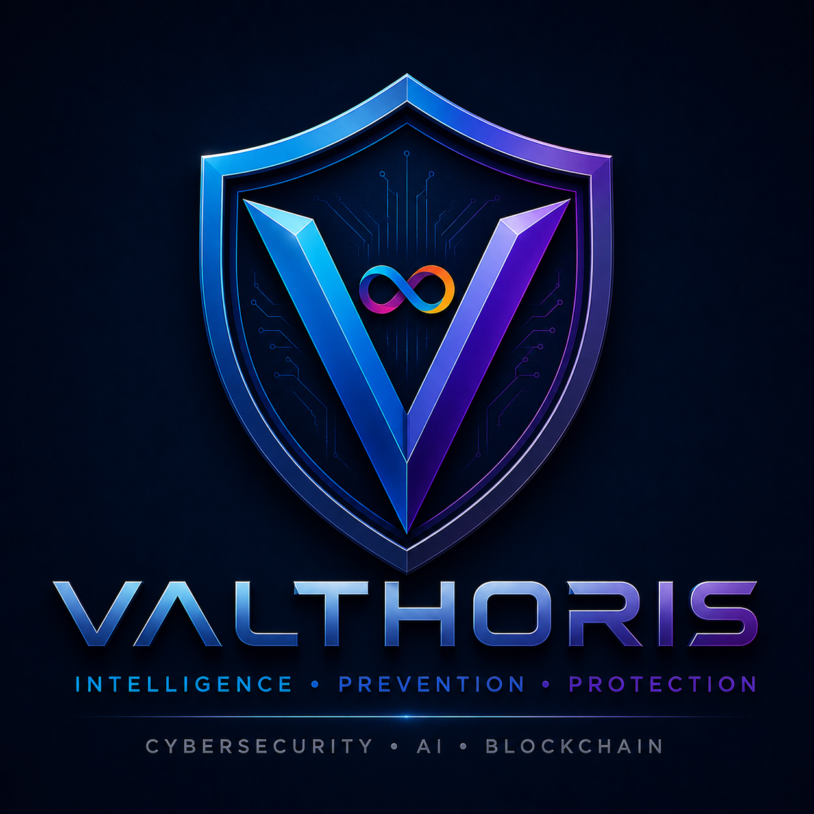

<div align="center">




# VALTHORIS

**INTELLIGENCE • PREVENTION • PROTECTION**  
*CYBERSECURITY • AI • BLOCKCHAIN*

A nova geração de Inteligência Artificial para prevenção de fraude.

[](#roadmap)
[](LICENSE)
[](#-dataset)

---

</div>


## 📑 Índice
1. [Sobre a Valthoris](#-sobre-a-valthoris)
2. [A Origem da Palavra "Valthoris"](#-a-origem-da-palavra-valthoris)
3. [Porque Nasceu a Valthoris](#-porque-nasceu-a-valthoris)
4. [Missão, Visão e Valores](#-miss%C3%A3o-vis%C3%A3o-e-valores)
5. [Filosofia](#-filosofia)
6. [O Escudo](#-o-escudo)
7. [Arquitetura](#%EF%B8%8F-arquitetura)
8. [Inteligência Artificial](#-intelig%C3%AAncia-artificial)
9. [Dataset](#-dataset)
10. [Módulos da Plataforma](#-m%C3%B3dulos-da-plataforma)
11. [Segurança e Conformidade](#-seguran%C3%A7a-e-conformidade)
12. [Roadmap](#-roadmap)
13. [Estrutura do Projeto](#-estrutura-do-projeto)
14. [Quick Start](#-quick-start)
15. [Métricas-Alvo](#-m%C3%A9tricas-alvo)
16. [Exemplos](#-exemplos)
17. [Contribuições](#-contribui%C3%A7%C3%B5es)
18. [Licença](#-licen%C3%A7a)
19. [Autor e Créditos](#-autor-e-cr%C3%A9ditos)

---

## 🌍 Sobre a Valthoris

A **Valthoris** é uma plataforma de Inteligência Artificial concebida para prevenir fraude, phishing, engenharia social e outras ameaças digitais antes de causarem danos.

O primeiro componente construído — e o foco atual deste repositório — é um modelo de classificação de texto (baseado em Transformer) capaz de identificar mensagens, emails e comunicações fraudulentas em português e inglês.

A visão de longo prazo é integrar este modelo numa plataforma mais ampla, construída sobre **Internet Computer Protocol (ICP)**, com módulos de deteção em tempo real, threat intelligence e um centro de comando administrativo — descrita em detalhe no *Master Blueprint*.

> **Nota de transparência:** Este repositório contém, hoje, o pipeline de dados, o tokenizer e a arquitetura do modelo de classificação. O treino do modelo e os restantes módulos estão documentados como visão e roadmap no projeto.

---

## 🌌 A Origem da Palavra "Valthoris"

**Valthoris** é uma palavra original, criada por Hermínio Coragem.
* Não existe em nenhum dicionário tradicional.
* Não deriva de nenhuma empresa existente.
* Não foi copiada nem adaptada.

Foi concebida como um **neologismo** para identificar uma plataforma cuja missão é prevenir fraude, proteger pessoas e criar confiança no mundo digital.

### A construção do nome

* **VAL:** O prefixo *Val* representa pilares fundamentais:
  * **Validação** — de identidades, transações e informação.
  * **Valor** — protegendo pessoas, património e ativos digitais.
  * **Valentia** — enfrentando ameaças tecnológicas e fraude organizada.
  * **Verdade** — promovendo informação fiável e verificável.
* **THORIS:** O sufixo *Thoris* foi criado para transmitir **robustez**, **autoridade**, **segurança**, **resistência** e **confiança**.

> **VALTHORIS:** Uma palavra que representa **Inteligência, Prevenção e Proteção**. Não é apenas um nome; é uma promessa.

---

## 💡 Porque Nasceu a Valthoris

A Valthoris nasceu da experiência direta do seu autor no desenvolvimento do *Antifraudapp*, uma aplicação de deteção de fraude para o mercado português. Ao longo desse trabalho, tornou-se claro que:
1. Milhões de pessoas continuam vulneráveis a fraude e phishing todos os dias.
2. A prevenção é sempre preferível à reparação de danos já causados.
3. A Inteligência Artificial deve ser usada para **proteger pessoas**.

---

## 🎯 Missão, Visão e Valores

* **Missão:** Desenvolver uma plataforma de Inteligência Artificial capaz de prevenir fraude, identificar riscos digitais e proteger pessoas, empresas e instituições através de tecnologias modernas, seguras e descentralizadas.
* **Visão:** Ser uma referência em Inteligência Artificial aplicada à prevenção da fraude e proteção digital.

### Valores
| Valor | Significado |
| :--- | :--- |
| **Ética** | A IA deve agir de forma justa e responsável |
| **Transparência** | Decisões explicáveis, não caixas-negras |
| **Privacidade** | Um direito fundamental, não uma opção |
| **Segurança** | Por defeito, em cada camada do sistema |
| **Responsabilidade** | Consciência do impacto real nas pessoas |
| **Inovação** | Melhoria contínua e aprendizagem constante |
| **Confiança** | Conquistada através da validação |

### Manifesto
* *A melhor fraude é aquela que nunca chega a acontecer.*
* *A tecnologia deve proteger pessoas antes de causar danos.*
* *A Inteligência Artificial deve trabalhar de forma ética, transparente e responsável.*
* *A privacidade é um direito.*
* *A confiança conquista-se através da validação.*

---

## 🛡️ Filosofia & O Escudo

* **Lema oficial:** `INTELLIGENCE • PREVENTION • PROTECTION`
* **Assinatura tecnológica:** `CYBERSECURITY • AI • BLOCKCHAIN`

### Princípios de Engenharia
* **Security by Design:** A segurança é parte da arquitetura desde a primeira linha de código.
* **Privacy by Design:** Dados pessoais são tratados com o mínimo necessário e protegidos por defeito.

### O Escudo
* **O Escudo:** Representa a proteção ativa e coletiva.
* **O "V":** Simboliza Valthoris.
* **O Infinito Central:** Representa o Internet Computer Protocol (ICP).

---

## 🏗️ Arquitetura

### Visão de alto nível (Longo Prazo)
```text
Frontend (React / Web / Mobile)
       ↓
Backend / API Gateway
       ↓
Canisters ICP ←→ Supabase (Postgres, Auth)
       ↓
Modelo de IA (Valthoris LLM)
       ↓
Threat Intelligence / APIs Externas


Input Text 
   ↓ Tokenizer BPE (16K tokens)
Token Embeddings (512D) + Positional Encoding
   ↓ 6x Transformer Blocks (8 heads, 512D)
Classification Head (Softmax)
   ↓ 
Output: [Legítimo | Phishing | Spam | Fraude]

Tecnologias Previstas
CamadaTecnologia
IA / MLPython, PyTorch, Tokenizers, scikit-learn
Backend DescentralizadoInternet Computer Protocol (ICP), Canisters, Motoko
Backend CentralizadoSupabase (PostgreSQL, Auth, Storage)
Frontend / MobileReact, TypeScript, Capacitor (Android / iOS)
CI/CDGitHub Actions, Docker

🧠 Inteligência Artificial & Dataset
O núcleo é um modelo de linguagem Transformer especializado e compacto (~30–50M parâmetros), treinado especificamente para a deteção de fraudes e phishing em ambientes bilingues (PT/EN).
Dataset Fonte: mnarrissa/Multilingual-Spam-Classification
Mapeamento de Labels:
0 — Legítimo (ham)
1 — Phishing
2 — Spam
3 — Fraude
🧩 Módulos da Plataforma
AutoShield: Proteção em tempo real contra SMS, chamadas, emails, URLs e QR codes.
Radar Global: Monitorização mundial de fraudes reportadas.
Scanner Universal: Análise de ficheiros, imagens e mensagens.
Threat & Crypto Intelligence: Análise de fontes de ameaças, carteiras e smart contracts.
Safe Location & Community: Segurança colaborativa entre utilizadores.
Dashboard: Centro de comando administrativo.
🔐 Segurança e Conformidade
A plataforma foi desenhada considerando os mais elevados padrões europeus e globais:
Zero Trust Model
Conformidade em vista: RGPD (GDPR), NIS2, AI Act, MiCA, DORA.
🗺️ Roadmap
[x] Fundação: Nome, marca, domínio, repositório.
[x] Tokenizer e Arquitetura do Modelo: Código base e scripts prontos.
[ ] Preparação de Dados: Dataset executado e validado.
[ ] Treino do Modelo: Execução do train.py.
[ ] Avaliação e Inferência: Validação e testes em tempo real.
[ ] Centro de Comando & ICP: Integração com Canisters e Supabase.
[ ] Aplicações Móveis: Android e iOS.
📁 Estrutura do Projeto
Valthoris-llm/
├── data/
│   ├── dataset.csv            # Dataset normalizado
│   ├── corpus.txt             # Corpus para o tokenizer
│   └── raw/                   # Cache local dos dados
├── model/
│   └── architecture.py        # Arquitetura do Transformer
├── tokenizer/
│   ├── train_tokenizer.py     # Script de treino do tokenizer
│   └── tokenizer.json         # Tokenizer treinado
├── docs/
│   ├── MASTER_BLUEPRINT.md    # Documento de arquitetura
│   ├── MASTER_CHECKLIST.md    # Checklist de implementação
│   └── assets/
│       └── valthoris-logo.png # Logótipo oficial
├── prepare_data.py            # Preparação de dados
├── train.py                   # Script de treino
├── evaluate.py                # Avaliação do modelo
├── inference.py               # Inferência em tempo real
├── requirements.txt           # Dependências
└── README.md                  # Documentação do repositório

🚀 Quick Start
1. Clonar o repositório e instalar dependências
git clone [https://github.com/Valthoris-code/Valthoris-llm.git](https://github.com/Valthoris-code/Valthoris-llm.git)
cd Valthoris-llm
pip install -r requirements.txt

2. Preparar os dados
python prepare_data.py --max-samples-per-language 10000

3. Treinar o Tokenizer
python tokenizer/train_tokenizer.py

4. Treinar e Avaliar o Modelo
python train.py
python evaluate.py

5. Inferência em Tempo Real
python inference.py --text "Clique aqui para confirmar a sua conta bancária: [https://link-suspeito.com](https://link-suspeito.com)"

📈 Métricas-Alvo
MétricaObjetivo
Acurácia> 95%
Precisão (Fraude)> 92%
Recall (Fraude)> 90%
F1-Score> 91%
📝 Exemplos
Input: "Olá, confirme o seu pedido #12345 em https://amazon.com/orders/12345"
Output: Legítimo (alta confiança)
Input: "Clique AGORA para confirmar a sua conta bancária: https://bit.ly/x7k9p"
Output: Phishing (alta confiança)
🤝 Contribuições & Licença
Contribuições são bem-vindas via Pull Requests!
Este projeto está sob a licença MIT — consulta o ficheiro LICENSE para mais detalhes.
👤 Autor e Créditos
Autor & Criador: Hermínio Coragem — Idealização, visão, arquitetura e liderança do projeto Valthoris.
Assistência Técnica: Ferramentas de Inteligência Artificial — Claude (Anthropic), ChatGPT (OpenAI) e Gemini (Google) — utilizadas como apoio técnico, revisão documental e aceleração do desenvolvimento.
<div align="center">
INTELLIGENCE • PREVENTION • PROTECTION
Última atualização: Julho 2026 · Estado: Em desenvolvimento 🚀
</div>
