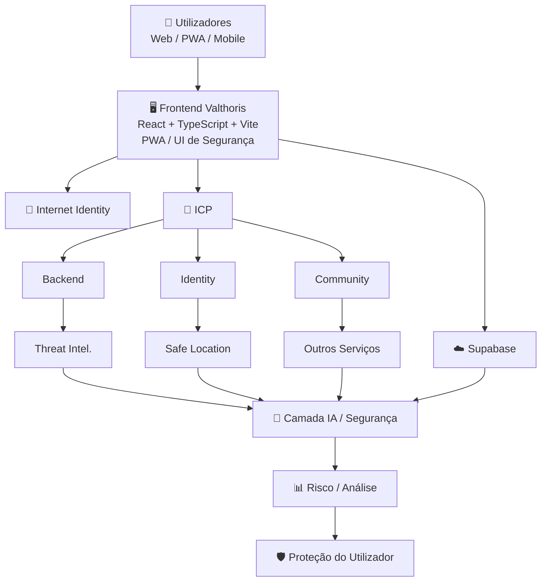
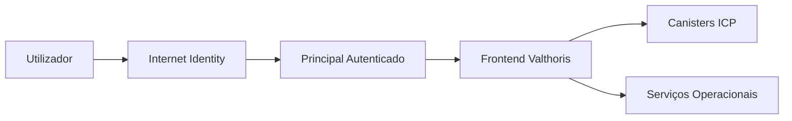
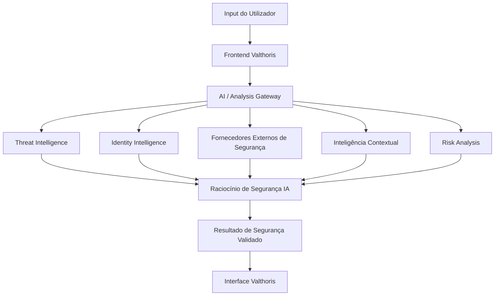
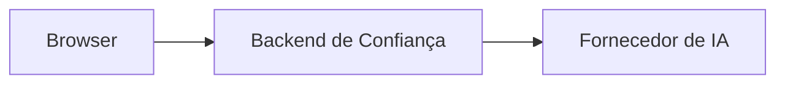
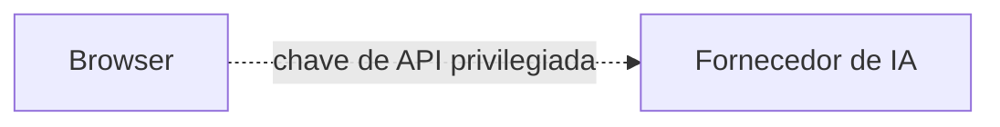
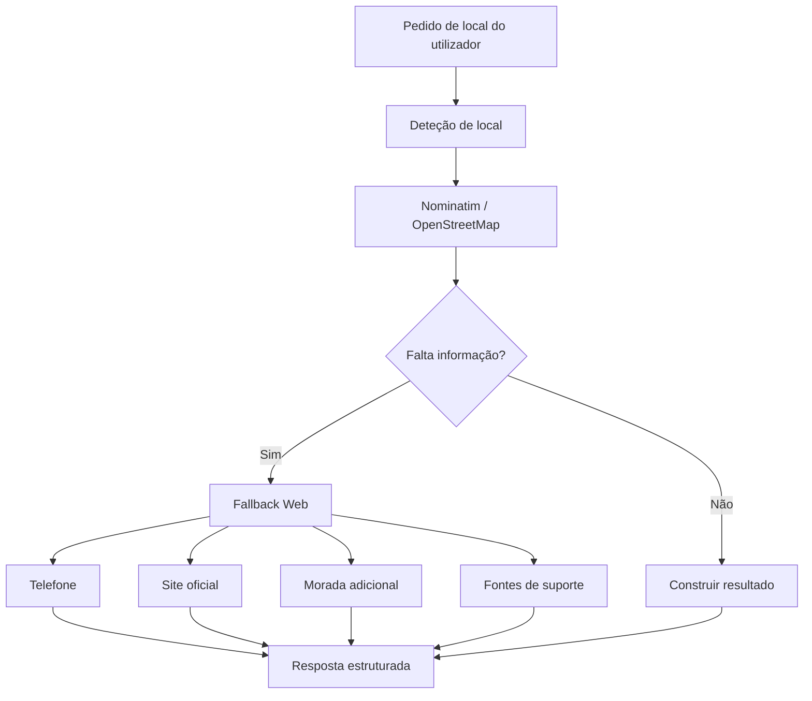
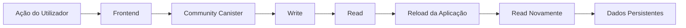
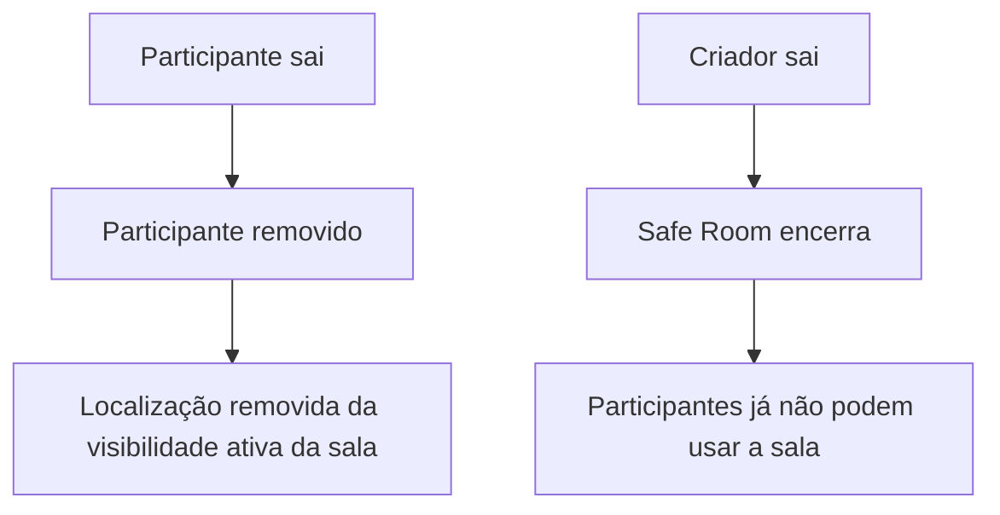
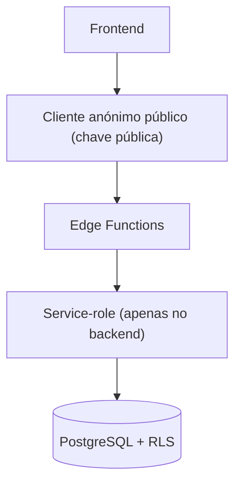

# VALTHORIS

 

## AI CYBERSECURITY & FRAUD PREVENTION

### Intelligence · Prevention · Protection

---
VALTHORIS

# 🛡️ VALTHORIS

### AI Cybersecurity & Fraud Prevention

**Intelligence · Prevention · Protection**

---

## Sobre o projeto

**Valthoris** é uma plataforma de ciberssegurança e prevenção de fraude orientada por IA, concebida para ajudar utilizadores a identificar atividade digital suspeita, analisar indicadores de segurança e receber orientação de segurança contextualizada.

A plataforma combina:

| Domínio | Descrição |
|---|---|
| 🤖 Inteligência Artificial | Análise e raciocínio de segurança assistidos por IA |
| 🌐 Threat Intelligence | Correlação de indicadores de ameaça de múltiplas fontes |
| 🪪 Identity Intelligence | Reputação e risco associados a identificadores (telefone, email, IBAN, wallet) |
| 🔎 Fraud Analysis | Deteção e análise de padrões de fraude |
| 🛰️ Security Scanning | Verificação unificada de indicadores de segurança |
| 👥 Community Intelligence | Reports e sinais partilhados pela comunidade |
| 🔗 Infraestrutura Descentralizada | Canisters ICP/Motoko |
| ☁️ Serviços Operacionais em Cloud | Supabase (Postgres, Edge Functions, Realtime) |
| ⚡ Proteção em Tempo Real | Conceitos de deteção e resposta imediata |
| 🔒 Privacidade e Controlo | Minimização de dados e controlos de acesso |

O projeto segue um princípio simples e não negociável:

> **"Build first. Verify second. Claim third."**
> *(Construir primeiro. Verificar depois. Anunciar por último.)*

Isto significa que o Valthoris distingue explicitamente entre tecnologia que **existe no repositório**, funcionalidade **implementada**, funcionalidade **testada em produção**, funcionalidade **em validação** e capacidades **futuras**.

---

## Índice

- [Visão do projeto](#visão-do-projeto)
- [Princípios fundamentais](#princípios-fundamentais)
- [Integridade da documentação](#integridade-da-documentação)
- [Estado atual do projeto](#estado-atual-do-projeto)
- [Arquitetura](#arquitetura)
- [Infraestrutura Internet Computer (ICP)](#infraestrutura-internet-computer-icp)
- [Frontend](#frontend)
- [Autenticação](#autenticação)
- [Arquitetura de IA](#arquitetura-de-ia)
- [AI Chat](#ai-chat)
- [Orquestração de inteligência](#orquestração-de-inteligência)
- [Universal Scanner](#universal-scanner)
- [Phone Intelligence](#phone-intelligence)
- [IBAN Intelligence](#iban-intelligence)
- [URL & Domain Intelligence](#url--domain-intelligence)
- [Place Intelligence](#place-intelligence)
- [Threat Intelligence](#threat-intelligence)
- [Identity Intelligence](#identity-intelligence)
- [Community Intelligence](#community-intelligence)
- [Safe Location](#safe-location)
- [Safe Rooms](#safe-rooms)
- [Supabase](#supabase)

---

## Visão do projeto

O objetivo de longo prazo do Valthoris é evoluir para uma plataforma abrangente de ciberssegurança e prevenção de fraude, capaz de apoiar indivíduos, organizações e, quando aplicável, ambientes institucionais.

A plataforma pretende fornecer uma camada de segurança capaz de analisar múltiplas classes de indicadores digitais:

`Telefones` · `Emails` · `URLs` · `Domínios` · `IPs` · `IBANs` · `Endereços cripto` · `Mensagens` · `QR codes` · `Ficheiros` · `Comunicações suspeitas` · `Locais e organizações` · `Indicadores de phishing` · `Evidência de fraude` · `Eventos de segurança`

O sistema é desenhado para **combinar múltiplos sinais**, em vez de depender de um único fornecedor ou de uma única base de dados.

> ⚠️ Um resultado de segurança deve ser entendido como uma **avaliação analítica baseada em evidência disponível** — nunca como prova automática de atividade criminosa.

---

## Princípios fundamentais

| Princípio | O que significa |
|---|---|
| **Security by Design** | Requisitos de segurança são considerados na arquitetura, implementação, integração e deployment — não apenas numa revisão final |
| **Privacy by Design** | Minimizar a recolha e exposição desnecessária de dados pessoais |
| **Zero Trust** | Autenticação não implica autorização. Toda operação sensível deve ser explicitamente autenticada, autorizada e limitada |
| **Least Privilege** | Credenciais, serviços, utilizadores e operações de backend recebem apenas as permissões estritamente necessárias |
| **Data Minimisation** | Apenas informação necessária à função de segurança relevante é processada |
| **Responsible AI** | Avaliações geradas por IA são sinais de segurança e apoio analítico — nunca factos confirmados, acusações criminais ou determinações de identidade definitivas |
| **Evidence-Based Engineering** | Uma funcionalidade não é considerada operacional apenas por existir na interface, ter código-fonte, ter uma API configurada, ter uma tabela na base de dados, ou ter tido um deployment bem-sucedido |

---

## Integridade da documentação

Este README segue um princípio estrito:

> **"Documentation must describe the system that exists today, not the system we intend to build tomorrow."**

Por isso, o Valthoris usa estados de implementação explícitos:

| Estado | Significado |
|:---:|---|
| 🟢 **Operacional** | Implementado, em deployment e verificado no workflow de produção relevante |
| 🟡 **Implementado / Validação** | Implementação existe, mas a validação completa em produção ainda é necessária |
| 🟠 **Em Desenvolvimento** | Existe implementação parcial e o desenvolvimento ativo continua |
| 🔵 **Planeado** | Funcionalidade no roadmap, ainda não representada como operacional |
| ⚪ **Investigação** | Investigação experimental ou futura |

> Uma funcionalidade **nunca** é promovida a 🟢 apenas por estar visível na interface.

---

## Estado atual do projeto

O Valthoris é um projeto de software real e funcional, com frontend ICP em produção, múltiplos canisters Motoko, infraestrutura de autenticação, módulos orientados a segurança e integrações de serviços operacionais.

No entanto, a plataforma permanece em **desenvolvimento ativo e validação sistemática**.

| Componente | Estado |
|---|:---:|
| Aplicação Web Valthoris | 🟢 Operacional |
| Frontend React / TypeScript / Vite | 🟢 Operacional |
| Deployment do frontend ICP | 🟢 Operacional |
| Internet Identity | 🟢 Implementado |
| Backend ICP | 🟡 Validação |
| Identity Intelligence | 🟡 Validação |
| Community | 🟡 Validação |
| Safe Location | 🟡 Validação |
| Safe Rooms | 🟡 Validação |
| Threat Intelligence | 🟡 Validação |
| Persistência de perfil | 🟡 Validação |
| Integração Supabase | 🟡 Validação |
| Sincronização Supabase | 🟠 Desenvolvimento / Validação |
| Arquitetura de IA | 🟡 Validação |
| Pipeline de pedido/resposta de IA | 🟡 Validação |
| Persistência de resultados de IA | 🟡 Validação |
| Universal Scanner | 🟡 Validação |
| Place Intelligence | 🟡 Validação |
| AutoShield | 🟠 Em Desenvolvimento |
| Audio Intelligence | 🔵 Planeado |
| Visual Intelligence | 🔵 Planeado |
| Malware Intelligence | 🔵 Planeado |
| Enterprise SIEM / SOAR | 🔵 Planeado |
| Integrações bancárias | 🔵 Planeado |
| Integrações institucionais | 🔵 Planeado |
| Blockchain intelligence avançada | 🔵 Planeado / Investigação |

---

## Arquitetura

O Valthoris usa atualmente uma arquitetura modular que combina infraestrutura descentralizada ICP com serviços operacionais.

> A arquitetura é modular por design. A existência de um componente não implica automaticamente que todos os componentes estejam ligados por um pipeline de produção totalmente verificado.

---

## Infraestrutura Internet Computer (ICP)

O Valthoris usa o **Internet Computer Protocol (ICP)** como infraestrutura descentralizada de aplicação e backend. O repositório define múltiplos canisters Motoko.

| Canister | Tecnologia | Papel | Estado |
|---|---|---|:---:|
| `frontend` | ICP Assets / React | Aplicação web | 🟢 |
| `backend` | Motoko | Backend principal | 🟡 |
| `community` | Motoko | Funcionalidade de comunidade | 🟡 |
| `identity` | Motoko | Identity intelligence | 🟡 |
| `threat_intelligence` | Motoko | Threat intelligence | 🟡 |
| `safe_location` | Motoko | Localização / geofencing | 🟡 |

> Os identificadores exatos de deployment devem ser sempre verificados no repositório e no deployment ao vivo antes de qualquer documentação formal de release ou auditoria.

---

## Frontend

O frontend do Valthoris é uma aplicação real em **React/TypeScript**, construída com **Vite**.

**Áreas da aplicação:**

`Autenticação` · `Perfil` · `AI Assistant` · `Universal Scanner` · `Threat Intelligence` · `Identity Intelligence` · `Global Radar` · `Safe Location` · `Safe Rooms` · `Community` · `Navegação de segurança` · `Informação legal e de privacidade` · `Interfaces operacionais de segurança`

O frontend não pretende ser um mock-up estático — mas uma interface funcional, por si só, não prova que todos os workflows subjacentes estejam prontos para produção.

---

## Autenticação

O Valthoris usa **Internet Identity** para autenticação.

**Estado:** 🟢 Implementado

> A persistência completa e a autorização cross-service permanecem sujeitas a validação em produção.

---

## Arquitetura de IA

A Inteligência Artificial é um componente central do Valthoris.

**Regra de arquitetura inegociável:** as credenciais dos fornecedores de IA nunca podem ser expostas ao browser.

✅ **Correto**

❌ **Incorreto**

---

## AI Chat

O assistente de IA do Valthoris é implementado em torno da arquitetura de serviço **"ai-chat"**, com o objetivo de suportar tanto análise de segurança como assistência contextual útil:

- Análise de URLs suspeitos
- Análise de números de telefone
- Análise de endereços de email
- Análise de IBANs
- Análise de endereços de criptomoeda
- Análise de mensagens suspeitas
- Recomendações de segurança
- Interpretação de inteligência devolvida por fornecedores externos
- Informação de segurança contextual
- Pedidos factuais de local/entidade (quando o pipeline de Place Intelligence está disponível)

**Princípio de resiliência:** uma falha temporária de um fornecedor externo não deve, sem necessidade, fazer falhar todo o pedido. Falhas de fornecedor devem ser representadas como **evidência indisponível**, nunca como evidência fabricada.

---

## Orquestração de inteligência

O Valthoris usa uma abordagem de orquestração em que diferentes fornecedores podem contribuir evidência:

`Reputação de IP` · `Reputação de domínio` · `Análise de URL` · `Malware intelligence` · `Validação de telefone` · `Email intelligence` · `Validação de IBAN` · `Cryptocurrency intelligence` · `Bases de dados de ameaças` · `Fontes públicas de informação`

O sistema distingue sempre entre:

| Estado do fornecedor | Interpretação |
|---|---|
| Disponível | Pode ser consultado normalmente |
| Indisponível | **Nunca** interpretado como evidência de maliciosidade |
| Sem evidência devolvida | Ausência de dados, não ausência de risco |
| Evidência suspeita devolvida | Sinal a ponderar na avaliação |
| Evidência conflituosa devolvida | Requer ponderação entre fontes |

---

## Universal Scanner

O scanner do Valthoris é um ponto de entrada de análise unificado.

**Tipos de input suportados:** `URLs` · `Domínios` · `IPs` · `Telefones` · `Emails` · `IBANs` · `Endereços cripto` · `QR codes` · `Mensagens` · `Ficheiros` · `Outros indicadores`

O objetivo é que o **utilizador forneça apenas o indicador** — é o Valthoris que determina o caminho de análise correto, sem exigir que o utilizador saiba qual base de dados ou fornecedor é necessário.

---

## Phone Intelligence

A análise de números de telefone pode incluir:

`Validação do número` · `Identificação de país` · `Informação geográfica` · `Tipo de linha` · `Informação de operadora (quando disponível)` · `Reputação` · `Indicadores de spam/fraude` · `Dados públicos de queixas` · `Evidência cross-provider` · `Avaliação de confiança`

> ⚠️ O sistema distingue claramente entre **número válido**, **número de confiança** e **contacto legítimo confirmado** — não são conceitos equivalentes. Um número tecnicamente válido pode ainda assim ser usado para fraude.

---

## IBAN Intelligence

A análise de IBAN pode incluir:

`Validação estrutural` · `Validação de dígitos de controlo` · `Validação de país` · `Validação de código bancário (quando suportado)` · `Inteligência de fornecedores` · `Evidência de reputação (quando disponível)`

> ⚠️ Um IBAN válido **não prova** propriedade, identidade do beneficiário, legitimidade da transação, ou ausência de fraude. A validação de IBAN é tratada como **um componente** da avaliação de segurança global.

---

## URL & Domain Intelligence

A análise de URLs e domínios pode incorporar inteligência de segurança externa, como:

`VirusTotal` · `URLScan` · `Reputação de domínio` · `Threat intelligence` · `Observações históricas` · `Classificações de segurança` · `Indicadores suspeitos`

O resultado distingue entre: **malicioso** · **suspeito** · **inconclusivo** · **legítimo / sem evidência de risco**

> A ausência de deteção maliciosa não equivale a uma garantia universal de segurança.

---

## Place Intelligence

O Valthoris suporta também um caminho de informação factual para locais e organizações reais, respondendo a pedidos como:

- *"Preciso do contacto da PSP de Évora."*
- *"Qual é o telefone do hospital?"*
- *"Onde fica determinada instituição?"*
- *"Qual é a morada de uma empresa?"*
- *"Qual é o site oficial deste serviço?"*

O resultado alvo deve fornecer, quando disponível: **nome oficial/reconhecido**, **morada**, **telefone**, **website**, **localização no mapa**, **fontes de suporte**, **contexto relevante** e **timestamp da recolha**.

> O sistema não deve inventar contactos quando as fontes não os fornecem.

---

## Threat Intelligence

O Valthoris tem uma arquitetura dedicada de Threat Intelligence, com o objetivo de longo prazo de correlacionar informação de múltiplas fontes numa imagem de segurança mais ampla.

**Categorias potenciais de inteligência:** `IPs maliciosos` · `Domínios maliciosos` · `URLs de phishing` · `Indicadores de malware` · `Indicadores de fraude` · `Endereços cripto` · `Identificadores reportados` · `Eventos de segurança` · `Reports da comunidade` · `Feeds externos de ameaças`

> A cobertura de threat intelligence é sempre descrita de acordo com as fontes efetivamente disponíveis e operacionais. O Valthoris **não reivindica** cobertura global universal apenas por existir um módulo de threat intelligence.

---

## Identity Intelligence

O canister **Identity** fornece uma camada de infraestrutura para inteligência de segurança relacionada com identidade, incluindo:

`Identificadores de telefone` · `Identificadores de email` · `Identificadores de domínio` · `Identificadores de IBAN` · `Identificadores de wallet cripto` · `Registos de reputação` · `Trust scores` · `Risk scores` · `Contagem de reports` · `Indicadores de burlão conhecido` · `Indicadores de negócio verificado` · `Registo de identificadores suspeitos` · `Batch lookup`

> Destina-se a apoiar análise de segurança — **nunca** deve ser interpretado como mecanismo de identificação ilegal, vigilância ou acusações sem suporte.

**Estado atual:** 🟡 Implementado / Validação

---

## Community Intelligence

O canister **Community** fornece uma camada de infraestrutura descentralizada para informação e reports de segurança da comunidade.

Até o ciclo completo ser verificado em produção, o Community permanece classificado como:

**Estado atual:** 🟡 Implementado / Validação

---

## Safe Location

O **Safe Location** fornece funcionalidade de partilha de localização e geofencing:

`Partilha de localização` · `Expiração de partilha` · `Revogação de partilha` · `Restrições de destinatário` · `Atualizações de localização` · `Consulta de localização` · `Partilhas pertencentes ao utilizador` · `Criação de geofence` · `Listagem de geofences` · `Eliminação de geofence` · `Validação de coordenadas` · `Cálculo de distância geográfica` · `Verificação de geofence`

O objetivo é fornecer uma camada de localização orientada a segurança, sem exigir que toda a funcionalidade de localização seja permanentemente pública.

**Estado atual:** 🟡 Implementado / Validação

---

## Safe Rooms

As **Safe Rooms** são uma funcionalidade de segurança multiutilizador construída em torno de salas partilhadas temporárias. Uma Safe Room permite que participantes autorizados partilhem a sua posição num mapa comum e comuniquem através de um chat privado, restrito à sala.

### Design atual

| Capacidade | Limite |
|---|:---:|
| Participantes | até 30 |
| Duração máxima | 24 horas |
| Raio de segurança | configurável, máx. 1000 m |
| Link partilhável | ✅ |
| Acesso específico por participante | ✅ |
| Atualizações de localização ao vivo | ✅ |
| Marcador por participante | 1 por participante |
| Chat privado da sala | ✅ |
| Saída de participante | ✅ |
| Remoção automática de localização ao sair | ✅ |
| Encerramento da sala ao sair o criador | ✅ |
| Isolamento entre salas diferentes | ✅ |

### Modelo de segurança

Os participantes só devem ver membros da **sua própria** Safe Room — participantes de outras salas nunca devem tornar-se visíveis através da interface da sala.

**Modelo de backend:** `safe_rooms` · `safe_room_participants` · `safe_room_messages`

> A fronteira de segurança é aplicada pelo **backend**, não apenas por controlos no lado do browser. O browser não recebe uma credencial privilegiada de service-role do Supabase — a Edge Function atua como fronteira operacional controlada para as operações de Safe Room.

### Limites de participação

| Limite | Valor |
|---|:---:|
| Participantes máximos | 30 |
| Duração máxima | 24 horas |
| Raio de segurança máximo | 1000 metros |

### Privacidade de localização

**Estado atual:** 🟡 Implementado / Validação — a funcionalidade principal está substancialmente implementada; refinamentos de UI e validação completa em produção continuam.

---

## Supabase

O **Supabase** é usado como camada de serviço operacional dentro do Valthoris.

**Serviços potenciais:** `PostgreSQL` · `Realtime` · `Storage` · `Queues` · `Infraestrutura de auditoria` · `Notificações` · `Sincronização operacional`

A integração com o Supabase é deliberadamente separada da infraestrutura descentralizada ICP — **ICP e Supabase não devem ser tratados como mecanismos de persistência intermutáveis.**

### Fronteira de segurança Supabase

> A chave `service-role` nunca é exposta ao browser. Toda operação privilegiada passa por uma Edge Function no backend.

---

**Valthoris** — *Build first. Verify second. Claim third.*

